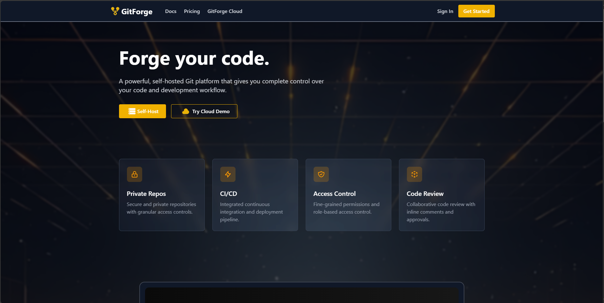

# 🚀 GitForge — Self-Hosted Git Platform

> A sleek, self-hosted alternative to GitHub, GitLab, and Bitbucket — built with **Ruby on Rails**, **TailwindCSS**, and **Devise** for modern team collaboration.


---

## 🖥️ Features

- 🔐 Authentication with **Devise** + **Google OAuth**
- 🧭 Custom dashboard with repository analytics
- 🧩 Modular design using partials
- 🎨 Dark-themed UI with Tailwind CSS
- 🔄 Activity feed for commits, PRs & issues
- 💼 Role-based access (upcoming)
- 📂 Project explorer (upcoming)

---

## 📸 Preview



---

## 📦 Tech Stack

- **Backend:** Ruby on Rails 7
- **Frontend:** Tailwind CSS
- **Auth:** Devise & Omniauth Google OAuth2
- **Database:** PostgreSQL
- **Icons:** Heroicons, Lucide

---

## 🚀 Getting Started

### Prerequisites

- Ruby `3.2+`
- Rails `7+`
- PostgreSQL
- Node.js & Yarn

### Setup Instructions

```bash
git clone https://github.com/your-username/gitforge.git
cd gitforge

bundle install
yarn install
rails db:create db:migrate

rails credentials:edit # Add Google OAuth credentials

./bin/dev
```

## ✅ TODO
- [x] User Authentication with Devise

- [x] Dashboard layout and structure

- [x] Sidebar navigation

- [ ] Repository management UI

- [ ] Issue & PR creation pages

- [ ] Notifications & Alerts

- [ ] User Profiles

- [ ] API integration for git actions

---

Made with ❤️ by **Team Habibis**